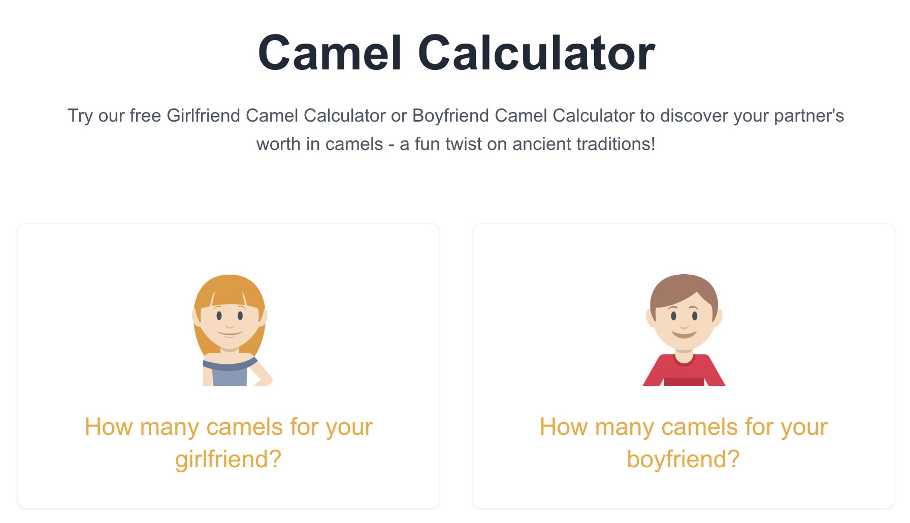

# Camel Calculator 🐪

Calculate your partner's worth in camels with our fun and entertaining Camel Calculator! Available for both boyfriends and girlfriends, this unique calculator brings a modern twist to ancient traditions.

[Visit Camel Calculator](https://camelcalculator.org)

## Features ✨

- **Boyfriend Calculator**: Evaluate characteristics like height, age, beard style, and body type
- **Girlfriend Calculator**: Consider factors such as height, age, hair length, and figure
- **Instant Results**: Get your camel worth calculation in seconds
- **Free to Use**: No registration or personal information required
- **Mobile Friendly**: Works perfectly on all devices
- **Share Results**: Easy sharing options with friends and family

## How It Works 🤔

Our Camel Calculator uses a sophisticated algorithm that considers multiple characteristics to determine a person's theoretical worth in camels. While based on ancient traditions, our modern interpretation adds fun and entertainment value to the concept.

### For Boyfriends:
- Age range: 18-90 years
- Height: 140-220 cm
- Multiple characteristics: Hair color, eye color, beard style, and body type
- Personalized results based on unique combinations

### For Girlfriends:
- Age range: 18-90 years
- Height: 140-220 cm
- Various features: Hair length, eye color, figure, and more
- Unique calculations for each combination

## Why Choose Camel Calculator? 🌟

1. **Entertainment Value**: Perfect for parties, social gatherings, or just for fun
2. **User Privacy**: No personal data stored or collected
3. **Global Reach**: Used by millions across 50+ countries
4. **Regular Updates**: Continuously improved algorithm and features
5. **Community Favorite**: Highly rated by users worldwide

## User Testimonials 💬

> "Such a fun way to spend time with friends! We couldn't stop comparing our camel values and laughing about the results." - Emma, 26

> "I love how detailed the calculator is! It's fascinating to see how different characteristics affect the final result." - Michael, 28

## Technical Details 🛠️

- Built with Next.js 14
- Deployed on Vercel
- Mobile-responsive design
- Fast and reliable calculations
- Secure and private

## About Us 👋

Camel Calculator started as a fun project to bring joy and laughter to people's lives. We've combined ancient traditions with modern technology to create an entertaining experience that celebrates human diversity in a lighthearted way.

## Privacy & Security 🔒

- No personal data collection
- No cookies used
- No registration required
- Google Analytics for basic usage statistics only

## Try It Now! 🚀

Visit [camelcalculator.org](https://camelcalculator.org) to:
- Calculate your boyfriend's camel worth
- Discover your girlfriend's camel value
- Share results with friends
- Join millions of satisfied users

## Contact 📧

Questions or suggestions? Reach out to us at:
contact@camelcalculator.org

---

*Note: The Camel Calculator is designed for entertainment purposes only. Every person's true value is beyond measure!*
